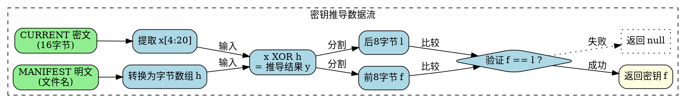
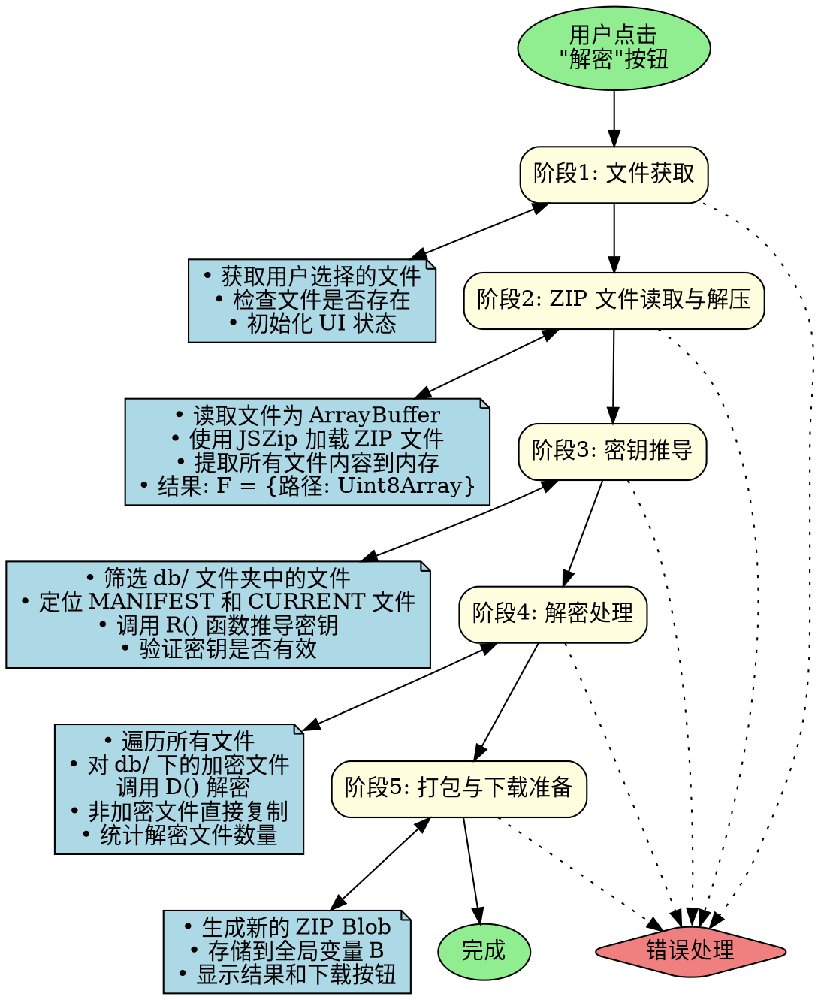
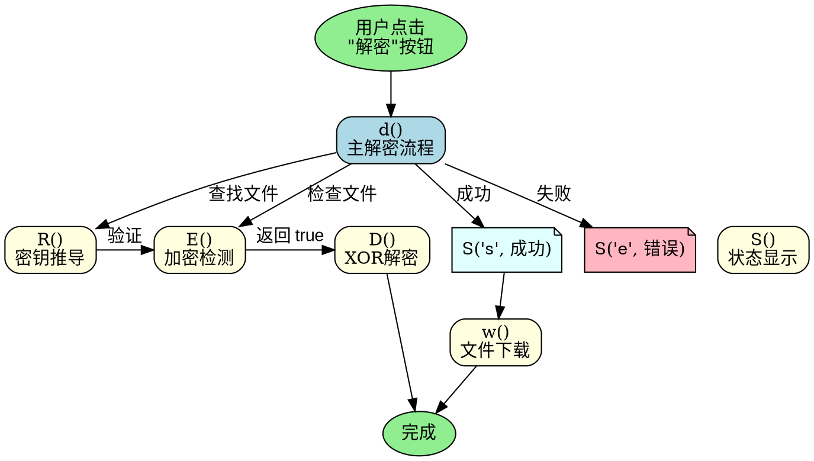
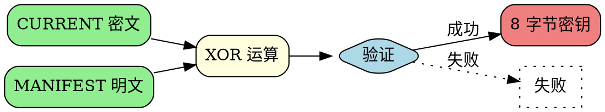

# MC解密工具 - 技术路径详解

## 第一部分：项目概览

| 项目信息 | 详情 |
|---------|------|
| **文件名** | mcXOR-MIT.html |
| **文件类型** | HTML/JavaScript |
| **核心功能** | Minecraft 存档 XOR 加密解密工具 |
| **依赖库** | JSZip v3.10.1 |
| **许可证** | MIT License (Copyright © 2026 UeCook) |


---

## 第二部分：常量定义

### 1. 默认密钥常量 K

```javascript
const K = [56, 56, 51, 50, 57, 56, 53, 49]
```

**ASCII 解码分析：**

| 十进制 | 字符 | 位置 |
|--------|------|------|
| 56 | '8' | 第1位 |
| 56 | '8' | 第2位 |
| 51 | '3' | 第3位 |
| 50 | '2' | 第4位 |
| 57 | '9' | 第5位 |
| 56 | '8' | 第6位 |
| 53 | '5' | 第7位 |
| 49 | '1' | 第8位 |

**明文密钥：** `"88529851"` (8位数字字符串)

**用途：** 当无法从存档中推导出密钥时，作为默认解密密钥使用

---

### 2. 魔数常量 M (Magic Number 1)

```javascript
const M = [128, 29, 48, 1]
```

- **作用：** 用于检测文件是否经过特定方式加密
- **位置：** 加密文件的前 4 个字节 (Byte 0-3)
- **检测逻辑：** 读取文件前 4 字节，逐字节对比是否等于 `[128, 29, 48, 1]`

---

### 3. 魔数常量 A (Magic Number 2)

```javascript
const A = [144, 29, 48, 1]
```

- **作用：** 另一种加密格式的魔数标识
- **位置：** 同样位于加密文件的前 4 个字节
- **检测逻辑：** 读取文件前 4 字节，逐字节对比是否等于 `[144, 29, 48, 1]`

---

## 第三部分：核心函数详解

### 函数 1：E(b) - 加密检测函数

```javascript
function E(b) {
    return b.length >= 4 && 
           ((b[0] == M[0] && b[1] == M[1] && b[2] == M[2] && b[3] == M[3]) || 
            (b[0] == A[0] && b[1] == A[1] && b[2] == A[2] && b[3] == A[3]))
}
```

**参数说明：**
- `b`: Uint8Array 类型的字节数组 (文件内容)

**返回值：**
- `Boolean`: `true`=已加密, `false`=未加密

**执行流程：**

1. **长度检查**
   - 检查 b.length >= 4
   - 如果文件长度小于4字节，返回 false

2. **魔数匹配检测**
   - 条件1: b[0:4] == [128, 29, 48, 1]
   - 条件2: b[0:4] == [144, 29, 48, 1]

3. **返回逻辑或结果**
   - return (条件1 || 条件2)

**技术要点：**
- 魔数 (Magic Number) 是文件格式的标识头
- 通过检测文件头来判断是否为加密文件
- 支持两种加密格式变体 (M 和 A)

---

### 函数 2：D(b, k) - XOR 解密函数

```javascript
function D(b, k) {
    if(!E(b)) throw '未加密';
    const c = k || K;
    const x = b.slice(4);
    const n = new Uint8Array(x.length);
    for(let i = 0; i < x.length; i++) {
        n[i] = x[i] ^ c[i % c.length];
    }
    return n;
}
```

**参数说明：**
- `b`: Uint8Array - 加密的文件内容 (含 4 字节魔数头)
- `k`: Array (可选) - 解密密钥，默认为常量 K

**返回值：**
- `Uint8Array`: 解密后的文件内容 (不含魔数头)

**执行流程：**

1. **加密验证**
   - 调用 E(b) 检测文件是否加密
   - 如果 !E(b) 则抛出异常: '未加密'

2. **密钥准备**
   - const c = k || K
   - 使用传入的密钥 k，或使用默认密钥 K

3. **分离密文**
   - const x = b.slice(4)
   - 跳过前4字节魔数头，提取真正的密文内容

4. **创建输出缓冲区**
   - const n = new Uint8Array(x.length)

5. **XOR 解密循环**
   ```javascript
   for(let i=0; i<x.length; i++) {
       n[i] = x[i] ^ c[i % c.length];
   }
   ```
   - 解密算法: 明文[i] = 密文[i] ^ 密钥[i % 密钥长度]

6. **返回明文**
   - return n

**XOR 加密原理：**

```
明文 ⊕ 密钥 = 密文
密文 ⊕ 密钥 = 明文

特性：
- 可逆性: (A ⊕ B) ⊕ B = A
- 交换律: A ⊕ B = B ⊕ A
- 结合律: (A ⊕ B) ⊕ C = A ⊕ (B ⊕ C)
```

**技术要点：**
- 使用对称 XOR 加密算法
- 密钥循环使用 (如果密钥长度 < 密文长度)
- 密钥长度 8 字节，简单的流密码实现

---

### 函数 3：R(m, c) - 密钥推导函数

```javascript
function R(m, c) {
    const x = c.slice(4, 20);
    const h = [];
    for(let i = 0; i < m.length; i++) {
        h.push(m.charCodeAt(i));
    }
    h.push(10);
    if(x.length != h.length) return null;
    const y = [];
    for(let i = 0; i < x.length; i++) {
        y[i] = x[i] ^ h[i];
    }
    const f = y.slice(0, 8), l = y.slice(8);
    for(let i = 0; i < 8; i++) {
        if(f[i] != l[i]) return null;
    }
    return f;
}
```

**参数说明：**
- `m`: String - MANIFEST 文件名 (如 "MANIFEST-000001")
- `c`: Uint8Array - CURRENT 文件内容

**返回值：**
- `Array`: 推导出的 8 字节密钥，或 `null` (推导失败)

**执行流程：**

1. **提取 CURRENT 文件的校验字节**
   - const x = c.slice(4, 20)
   - 从第 5 到第 20 字节 (共 16 字节)

2. **转换 MANIFEST 文件名为字节数组**
   - 例如: "MANIFEST-000001"
   - 'M'→77, 'A'→65, 'N'→78, 'I'→73...
   - 最后追加: 10 (换行符 '\n')

**MANIFEST 文件编号说明：**
- 文件名格式: "MANIFEST-" + 6位数字序列号
- 例如: "MANIFEST-000001", "MANIFEST-000002", "MANIFEST-000003"
- 000001 是序列号，表示这是第1个MANIFEST文件
- LevelDB每次创建新的MANIFEST文件时，序列号自动递增
- CURRENT文件始终指向当前最新的MANIFEST文件编号

**作用：**
- 版本控制: 区分不同时间点的数据库元数据状态
- 原子更新: LevelDB通过创建新MANIFEST文件并更新CURRENT指针来实现原子性
- 数据恢复: 保存历史元数据，便于故障恢复

3. **长度验证**
   - if(x.length != h.length) return null
   - 验证两者长度是否一致 (应为 16 字节)

4. **异或计算推导密钥**
   ```javascript
   for(let i=0; i<x.length; i++) {
       y[i] = x[i] ^ h[i];
   }
   ```
   - 计算原理: 已知 x = h ⊕ key(重复)，因此 y = x ⊕ h = key

5. **分离推导结果**
   - const f = y.slice(0, 8)  // 前 8 字节
   - const l = y.slice(8)     // 后 8 字节

6. **密钥验证**
   - 验证前 8 字节和后 8 字节是否完全相同
   - 如果不相同，说明推导失败

7. **返回密钥**
   - return f  // 返回推导出的 8 字节密钥

**技术要点：**
- 利用 LevelDB 的内部结构特征推导密钥
- 这是已知明文攻击 (Known Plaintext Attack) 的实际应用
- CURRENT 文件存储了 MANIFEST 文件名，形成已知明文

**数据流向：**



---

### 函数 4：d() - 主解密流程函数

```javascript
let B = null;  // 全局变量，存储解密后的 ZIP Blob

async function d() {
    // 阶段1: 文件获取
    const i = document.getElementById('f').files[0];
    if(!i) { S('e', '请选文件'); return }
    const p = document.getElementById('p'), r = document.getElementById('r');
    p.style.display = 'block';
    p.textContent = '读取中...';
    r.style.display = 'none';
    
    try {
        // 阶段2: ZIP 文件读取与解压
        const a = await i.arrayBuffer();
        p.textContent = '解压中...';
        const z = await JSZip.loadAsync(a), F = {};
        for(const x in z.files) {
            if(!z.files[x].dir) {
                F[x] = await z.files[x].async('uint8array');
            }
        }
        
        // 阶段3: 密钥推导
        const O = Object.keys(F).filter(x => x.startsWith('db/'));
        if(!O.length) throw '无db文件夹';
        p.textContent = `找到${O.length}个文件，推导密钥...`;
        const n = O.find(f => /MANIFEST-\d+/.test(f));
        const u = O.find(f => f.endsWith('CURRENT'));
        if(!n || !u) throw '无法推导密钥';
        const k = R(n.split('/').pop(), F[u]);
        if(!k) throw '推导失败';
        
        // 阶段4: 解密处理
        p.textContent = '解密中...';
        const N = new JSZip();
        let C = 0;
        for(const x in F) {
            const w = F[x];
            if(x.startsWith('db/')) {
                if(E(w)) {
                    N.file(x, D(w, k));
                    C++;
                } else {
                    N.file(x, w);
                }
            } else {
                N.file(x, w);
            }
        }
        
        // 阶段5: 打包与下载准备
        p.textContent = '打包中...';
        const g = await N.generateAsync({
            type: 'blob',
            compression: 'STORE'
        });
        B = g;
        p.textContent = '完成';
        S('s', `<p><strong>解密成功！</strong></p>
                <p>已解密${C}个文件</p>
                <p>大小:${(g.size/1024/1024).toFixed(2)}MB</p>
                <button onclick="w('${i.name.replace('.zip','')}')">下载</button>`);
    } catch(e) {
        p.textContent = '失败';
        S('e', `错误:${e.message}`);
    }
}
```

**执行流程图：**



**错误处理：**

| 错误信息 | 原因 |
|---------|------|
| '无db文件夹' | ZIP 中缺少 db 目录 |
| '无法推导密钥' | 缺少 MANIFEST 或 CURRENT 文件 |
| '推导失败' | 密钥推导算法失败 (R 返回 null) |
| '未加密' | 尝试解密未加密文件 (内部错误) |

---

### 函数 5：S(t, m) - 状态显示函数

```javascript
function S(t, m) {
    const r = document.getElementById('r');
    r.innerHTML = m;
    r.style.display = 'block';
}
```

**功能：** 在结果区域显示消息或 HTML 内容

---

### 函数 6：w(n) - 文件下载函数

```javascript
function w(n) {
    if(!B) { alert('无可下载文件'); return }
    const u = URL.createObjectURL(B), a = document.createElement('a');
    a.href = u;
    a.download = n + '_Decrypted.zip';
    document.body.appendChild(a);
    a.click();
    document.body.removeChild(a);
    URL.revokeObjectURL(u);
}
```

**执行流程：**

1. **检查 Blob 可用性**
   - if(!B) alert('无可下载文件')

2. **创建 Blob URL**
   - const u = URL.createObjectURL(B)
   - 格式: blob:origin/uuid

3. **创建下载链接元素**
   - const a = document.createElement('a')
   - a.href = u
   - a.download = '原文件名_Decrypted.zip'

4. **触发下载**
   - 添加到 DOM → 模拟点击 → 移除元素

5. **释放 URL 对象**
   - URL.revokeObjectURL(u)  // 防止内存泄漏

---

## 第四部分：UI 结构

### HTML 元素

```html
<h1>MC解密</h1>
<label>选择存档(.zip)</label>
<input type="file" id="f" accept=".zip">
<button onclick="d()">解密</button>
<div id="p"></div>  <!-- 进度显示区域 -->
<div id="r"></div>  <!-- 结果显示区域 -->
```

| 元素 | ID | 用途 |
|------|-----|------|
| `<input type="file">` | `f` | 文件选择，仅接受 .zip 文件 |
| `<button>` | - | 触发主解密流程 |
| `<div>` | `p` | 显示处理进度 |
| `<div>` | `r` | 显示解密结果或错误信息 |

---

## 第五部分：加密原理

### XOR 加密算法

**真值表：**

| A | B | A ⊕ B |
|---|---|--------|
| 0 | 0 | 0 |
| 0 | 1 | 1 |
| 1 | 0 | 1 |
| 1 | 1 | 0 |

**加密特性：**
1. 可逆性: `(A ⊕ B) ⊕ B = A`
2. 交换律: `A ⊕ B = B ⊕ A`
3. 结合律: `(A ⊕ B) ⊕ C = A ⊕ (B ⊕ C)`

### 本工具的加密格式

```
┌─────────────┬──────────────────────────────────────┐
│ 魔数头(4B)  │           密文内容                    │
├─────────────┼──────────────────────────────────────┤
│ [128,29,    │  原始数据 XOR 密钥循环               │
│  48,1] 或   │                                      │
│ [144,29,    │  Key = [k0,k1,k2,k3,k4,k5,k6,k7]   │
│  48,1]      │                                      │
│             │  Plain[i] = Cipher[i] XOR Key[i%8]  │
└─────────────┴──────────────────────────────────────┘
```

### 已知明文攻击原理

**攻击前提：**
1. 知道部分明文内容 (MANIFEST 文件名)
2. 能获取对应的密文 (加密的 CURRENT 文件)
3. 知道加密算法 (XOR)

**攻击公式：**
```
已知: Cipher = Plain ⊕ Key
推导: Key = Cipher ⊕ Plain
```

**本工具应用：**
- CURRENT 文件包含明文: `"MANIFEST-XXXXXX\n"`
- 加密后存储在 ZIP 中
- 通过 XOR 运算恢复密钥

---

## 第六部分：LevelDB 结构

### LevelDB 文件组成

典型的 Minecraft 存档的 `db` 文件夹：

```
db/
├── CURRENT              # 当前 MANIFEST 文件名指针 (1行文本)
├── MANIFEST-XXXXXX      # 元数据清单文件 (记录 SST 文件信息)
├── 000001.ldb           # LDB 数据文件 (键值对存储)
├── 000002.ldb           # LDB 数据文件
├── ...                  # 更多 LDB 文件
└── LOCK                 # 锁文件 (通常为空)
```

### CURRENT 文件格式

**明文格式：**
```
MANIFEST-000001\n
```
- 纯文本
- 包含当前活动的 MANIFEST 文件名
- 以换行符 `0x0A` 结尾

**加密后格式：**
```
[128,29,48,1] + XOR(CURRENT内容, Key)
```
- 4 字节魔数头
- XOR 加密的内容

---

## 第七部分：安全分析

### 加密强度评估

**弱点：**
- 使用固定魔数头，易被识别
- 密钥长度仅 8 字节，暴力破解空间小 (2^64)
- 使用 XOR 算法，存在已知明文攻击漏洞
- 密钥重复循环使用，可能泄露统计信息

**优势：**
- 快速加密解密
- 适合游戏存档保护 (防 casual 修改)
- 无需用户管理密钥

### 适用场景

✅ **适合：**
- 防止普通玩家随意修改存档
- 存档文件完整性校验

❌ **不适合：**
- 高安全需求的数据加密
- 防御专业攻击者的场景

---

## 第八部分：函数调用关系图



---

## 第九部分：依赖与引用

### 外部依赖

**1. JSZip v3.10.1**
- URL: https://cdnjs.cloudflare.com/ajax/libs/jszip/3.10.1/jszip.min.js
- 用途: ZIP 文件读写
- 许可证: MIT/GPLv3 双许可

### 灵感来源

**2. XOR-MC-Archive-Decrypt**
- 作者: HTMonkeyG
- URL: https://github.com/HTMonkeyG/XOR-MC-Archive-Decrypt
- 许可证: MIT License

---

## 第十部分：技术总结

### 核心技术创新点

1. **纯前端实现** - 无需服务器，浏览器本地处理
2. **自动密钥推导** - 利用 LevelDB 结构特征自动恢复密钥
3. **已知明文攻击实践** - 将密码学攻击理论应用于实际工具
4. **流式处理** - 支持大文件 ZIP 处理

### 代码质量评估

**优点：**
- 单文件实现，部署简单
- 使用现代 ES6+ 语法 (async/await, const/let)
- 函数职责单一，逻辑清晰
- 包含完整错误处理

**可改进：**
- 变量命名过于简短 (E, D, R, S 等)
- 缺少详细注释说明
- 硬编码常量较多
- 缺少输入验证

---

## 第十一部分：完整数据流

### 加密数据流向


### 解密数据流向


### 密钥推导数据流向



---

## 第十二部分：完整代码清单

```html
<!DOCTYPE html>
<html lang="zh-CN">
    <head>
        <meta charset="UTF-8">
        <meta name="viewport" content="width=device-width,initial-scale=1">
        <title>MC解密</title>
        <script src="https://cdnjs.cloudflare.com/ajax/libs/jszip/3.10.1/jszip.min.js"></script>
    </head>
    <body>
        <h1>MC解密</h1>
        <label>选择存档(.zip)</label>
        <input type="file" id="f" accept=".zip">
        <button onclick="d()">解密</button>
        <div id="p"></div>
        <div id="r"></div>
        <script>
            // 常量定义
            const K = [56, 56, 51, 50, 57, 56, 53, 49],  // 默认密钥 "88529851"
                  M = [128, 29, 48, 1],                  // 魔数 1
                  A = [144, 29, 48, 1];                  // 魔数 2
            
            // 加密检测函数
            function E(b) {
                return b.length >= 4 && 
                       ((b[0] == M[0] && b[1] == M[1] && b[2] == M[2] && b[3] == M[3]) || 
                        (b[0] == A[0] && b[1] == A[1] && b[2] == A[2] && b[3] == A[3]));
            }
            
            // XOR 解密函数
            function D(b, k) {
                if(!E(b)) throw '未加密';
                const c = k || K;
                const x = b.slice(4);
                const n = new Uint8Array(x.length);
                for(let i = 0; i < x.length; i++) {
                    n[i] = x[i] ^ c[i % c.length];
                }
                return n;
            }
            
            // 密钥推导函数
            function R(m, c) {
                const x = c.slice(4, 20);
                const h = [];
                for(let i = 0; i < m.length; i++) {
                    h.push(m.charCodeAt(i));
                }
                h.push(10);
                if(x.length != h.length) return null;
                const y = [];
                for(let i = 0; i < x.length; i++) {
                    y[i] = x[i] ^ h[i];
                }
                const f = y.slice(0, 8), l = y.slice(8);
                for(let i = 0; i < 8; i++) {
                    if(f[i] != l[i]) return null;
                }
                return f;
            }
            
            // 全局变量：存储解密后的 ZIP Blob
            let B = null;
            
            // 主解密流程函数
            async function d() {
                const i = document.getElementById('f').files[0];
                if(!i) { S('e', '请选文件'); return }
                const p = document.getElementById('p'), r = document.getElementById('r');
                p.style.display = 'block';
                p.textContent = '读取中...';
                r.style.display = 'none';
                
                try {
                    const a = await i.arrayBuffer();
                    p.textContent = '解压中...';
                    const z = await JSZip.loadAsync(a), F = {};
                    for(const x in z.files) {
                        if(!z.files[x].dir) {
                            F[x] = await z.files[x].async('uint8array');
                        }
                    }
                    
                    const O = Object.keys(F).filter(x => x.startsWith('db/'));
                    if(!O.length) throw '无db文件夹';
                    p.textContent = `找到${O.length}个文件，推导密钥...`;
                    const n = O.find(f => /MANIFEST-\d+/.test(f));
                    const u = O.find(f => f.endsWith('CURRENT'));
                    if(!n || !u) throw '无法推导密钥';
                    const k = R(n.split('/').pop(), F[u]);
                    if(!k) throw '推导失败';
                    
                    p.textContent = '解密中...';
                    const N = new JSZip();
                    let C = 0;
                    for(const x in F) {
                        const w = F[x];
                        if(x.startsWith('db/')) {
                            if(E(w)) {
                                N.file(x, D(w, k));
                                C++;
                            } else {
                                N.file(x, w);
                            }
                        } else {
                            N.file(x, w);
                        }
                    }
                    
                    p.textContent = '打包中...';
                    const g = await N.generateAsync({
                        type: 'blob',
                        compression: 'STORE'
                    });
                    B = g;
                    p.textContent = '完成';
                    S('s', `<p><strong>解密成功！</strong></p>
                            <p>已解密${C}个文件</p>
                            <p>大小:${(g.size/1024/1024).toFixed(2)}MB</p>
                            <button onclick="w('${i.name.replace('.zip','')}')">下载</button>`);
                } catch(e) {
                    p.textContent = '失败';
                    S('e', `错误:${e.message}`);
                }
            }
            
            // 状态显示函数
            function S(t, m) {
                const r = document.getElementById('r');
                r.innerHTML = m;
                r.style.display = 'block';
            }
            
            // 文件下载函数
            function w(n) {
                if(!B) { alert('无可下载文件'); return }
                const u = URL.createObjectURL(B), a = document.createElement('a');
                a.href = u;
                a.download = n + '_Decrypted.zip';
                document.body.appendChild(a);
                a.click();
                document.body.removeChild(a);
                URL.revokeObjectURL(u);
            }
        </script>
        <div>
            <a href="https://github.com/Stuk/jszip" target="_blank">JSZip</a> | 
            <a href="https://github.com/HTMonkeyG/XOR-MC-Archive-Decrypt" target="_blank">XOR-MC-Archive-Decrypt(灵感来源)</a>
        </div>
    </body>
</html>
```

---

## 第十三部分：许可证信息

### MIT License

**Copyright © 2026 UeCook**

Permission is hereby granted, free of charge, to any person obtaining a copy of this software and associated documentation files (the "Software"), to deal in the Software without restriction, including without limitation the rights to use, copy, modify, merge, publish, distribute, sublicense, and/or sell copies of the Software, and to permit persons to whom the Software is furnished to do so, subject to the following conditions:

The above copyright notice and this permission notice shall be included in all copies or substantial portions of the Software.

THE SOFTWARE IS PROVIDED "AS IS", WITHOUT WARRANTY OF ANY KIND, EXPRESS OR IMPLIED, INCLUDING BUT NOT LIMITED TO THE WARRANTIES OF MERCHANTABILITY, FITNESS FOR A PARTICULAR PURPOSE AND NONINFRINGEMENT. IN NO EVENT SHALL THE AUTHORS OR COPYRIGHT HOLDERS BE LIABLE FOR ANY CLAIM, DAMAGES OR OTHER LIABILITY, WHETHER IN AN ACTION OF CONTRACT, TORT OR OTHERWISE, ARISING FROM, OUT OF OR IN CONNECTION WITH THE SOFTWARE OR THE USE OR OTHER DEALINGS IN THE SOFTWARE.

---

**文档生成时间：** 2026-02-07  
**文档版本：** v1.0  
**技术路径分析：** mcXOR-MIT开源版本.html
